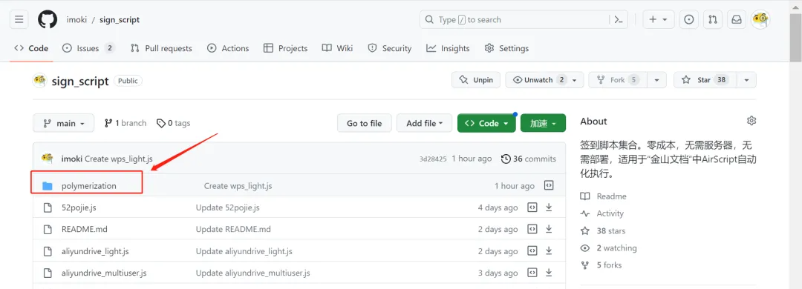
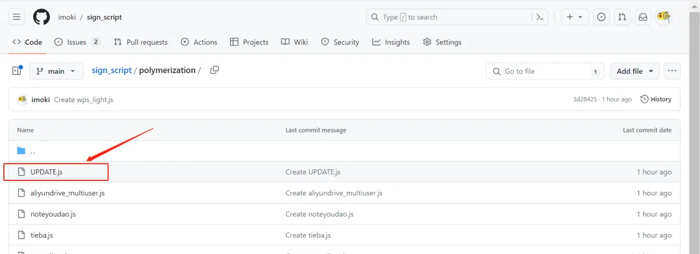
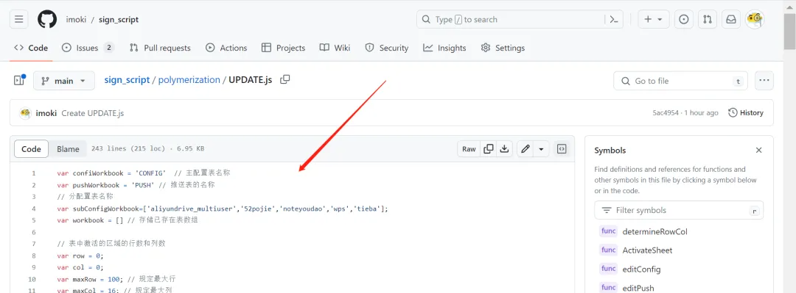
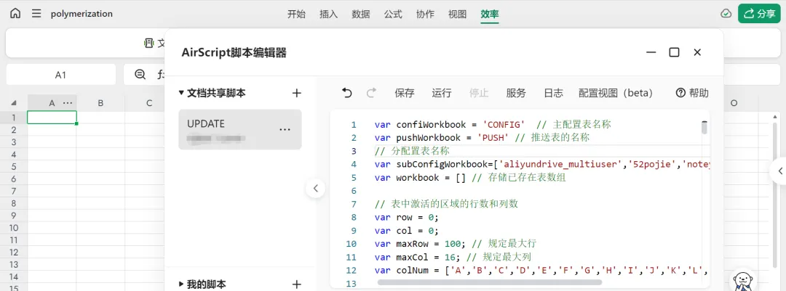
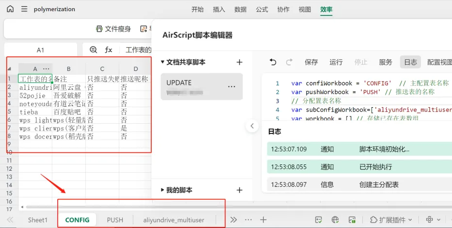
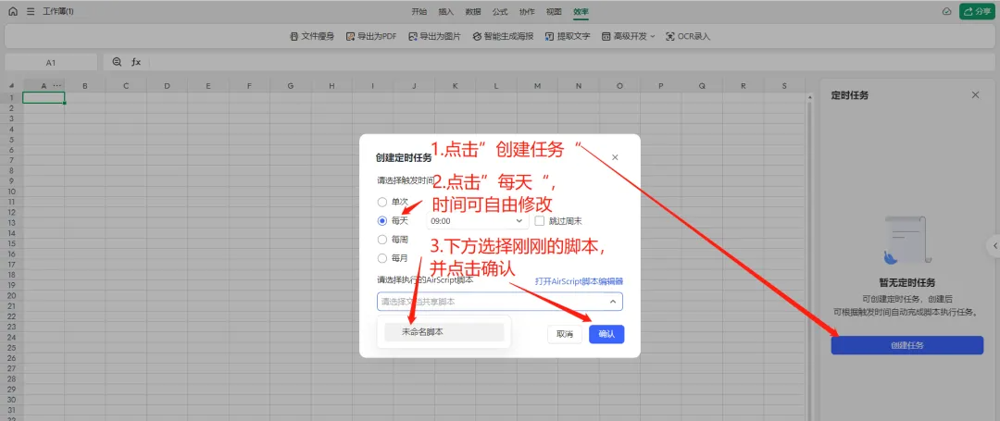
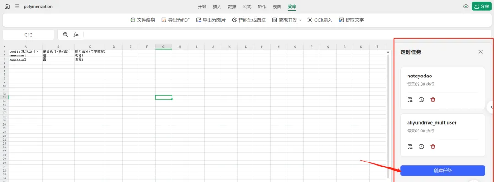

# 分离式推送使用方法（已使用PUSH.js推送脚本的可忽略）

具体推送配置填写请查看“[**推送配置（金山文档）**](../%E6%8E%A8%E9%80%81%E9%85%8D%E7%BD%AE%EF%BC%88%E9%87%91%E5%B1%B1%E6%96%87%E6%A1%A3%EF%BC%89%2012d1fc355aa981a09982f1698ab5b998.md)”文章

# **说明**

**支持消息合并推送、消息分平台推送（金山文档）**

本次更新针对金山文档。本次更新新增功能独立多平台推送、消息池整合推送、只生成存活的表格配置。

**推送方式：**

**@all方式代表在PUSH表内的消息推送平台都推送（bark、pushplus、钉钉等等）**

**bark方式代表，仅用推送bark**

**dingtalk方式代表，仅用推送钉钉**

**bark&pushplus方式，同时推送bark和pushplus。用&连接**

**bark&email&pushplus方式，同时推送bark、email和pushplus。**

**加入消息池：**

这个的意思是“加入消息池”选项勾选“是”的就会**合并为一条消息进行通知**，以@all方式推送。例如你运行了8个签到任务，那么在某个时刻只收到1条通知消息。

默认为“否”，代表每个签到结果都用**独立的一条**消息通知。例如你运行了8个签到任务，那么在某个时刻会同时收到8条通知消息。

# 如何使用（三步走，已使用原签到脚本，也需更新具体签到脚本）

1. **更新UPDATE脚本**

从github复制最新UPDATE.js脚本，并运行，即可生成最新的CONFIG表格。

进入github中复制最新的UPDATE.js的代码（此为更新脚本，运行则会自动新增表格配置、不会覆盖原有信息）

将复制的UPDATE.js代码粘贴到脚本编辑器中，点击"保存"，再点击运行。当UPDATE脚本运行完后，会自动生成配置表格。

**2.加PUSH脚本**

从github复制最新的PUSH.js脚本。

**3.将PUSH脚本加入定时任务**。

PUSH定时任务的时间可以定在所有任务执行完后的时间。

也可以一天定多个PUSH定时任务，时间任意，例如：8:00、12:00、16:00。时间到后会检查哪些脚本没推送，就会进行推送了。

依次点击“高级开发”-“定时任务”，将刚刚的脚本添加到定时任务中。

点击“创建任务”-“每天”，选择此脚本。此时就完成了，每天指定时间将会进行推送。

# **问题**

**问：推送方式填的英文字母哪里来的。PUSH表第一列的推送类型。如bark。**

**问：CONFIG和PUSH推送的优先级**

PUSH表作为某个推送类型的总开关，例如PUSH表中bark选择了“否”，其他推送方式选择了“是”。

那么即使CONFIG表”是否通知“选择”是“且推送方式为“bark”，都不会进行推送bark推送。

但是如果推送方式为@all，那么仅”bark“方式不推送，PUSH表其他选择“是”的推送方式都推送

如果CONFIG的“是否通知”选择“否”，那么就完全不推送

**问：我想所有消息都合为一条推送怎么弄**

CONFIG表，“加入消息池”全部选择“是”即可